# The Vinyl Hub

## Table of Contents

## Project Overview
The Vinyl Hub is an e-commerce site selling classic vinyls, audio accessories and record players.
It aims to build a customer base by providing high quality products and also developing a community,
by allowing registered user a way to interact and show their vinyl collections by filling out a profile form.
Registered users would also have the ability to request albums that could be added to the store. Due to the big scope
I have planned for this project the profile section is basic. In future releases it will be added to significally.
Theree is still discounts applied and the delivery details saved so I feel there is enough incentive for our shoppers to sign up
to become site members.

### Target Audience

The target audience is the ever growing vinyl market in Ireland and abroad.
There is a real movememt towards real and authentic sound and this site is hoping to be a part of that 
by offering top quality products to those looking.

### Business Logic

This is straight forward as the business aspect would come directly selling our products in 
the shop or fulfiiling our registered members request forms for products we can obtain.

### User Stories 
I built my user stories in an agile framework where I built upon the foundations laid in 
the code institue's Boutique Ado project and tailored them to the needs of my projects users and store owner.
The table below are the stories upon which this project was built

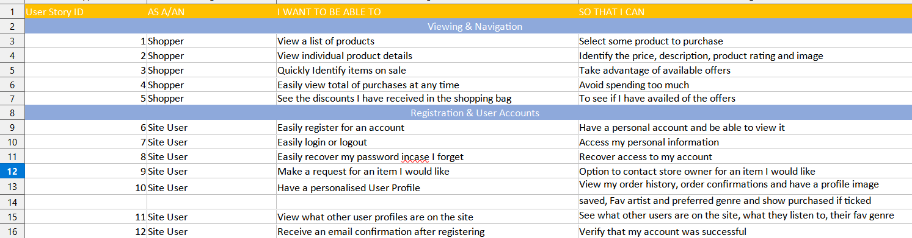
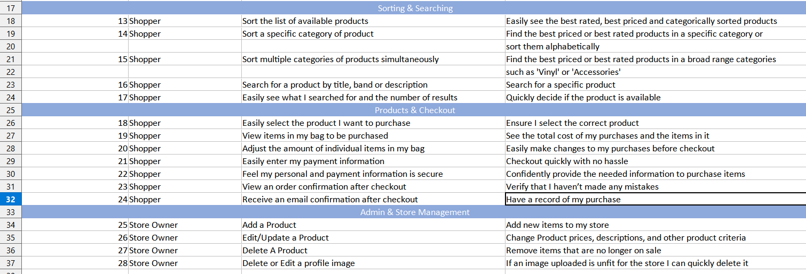

## UX

### Design Choices 

#### Colour Pallette

The overall structure of the site is based off bootstrap 5's row and column classes.
The colours and overall theme of the site is based off a vibrant 80's colour pallette, i.e. MTV'S 80's logo.

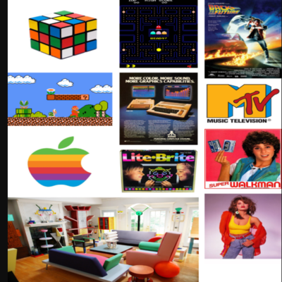

From these images I decided on `#fcb014`, `#c01b21`and `#018bd4` as this would have the feel and style from the 80's,
a time when Vinyls were at their peak. Due to accessability reasons I had to alter the blue to `#047ab7` for greater contrast for the users.

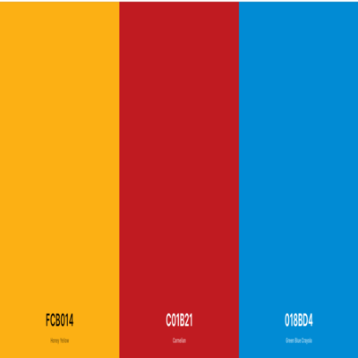

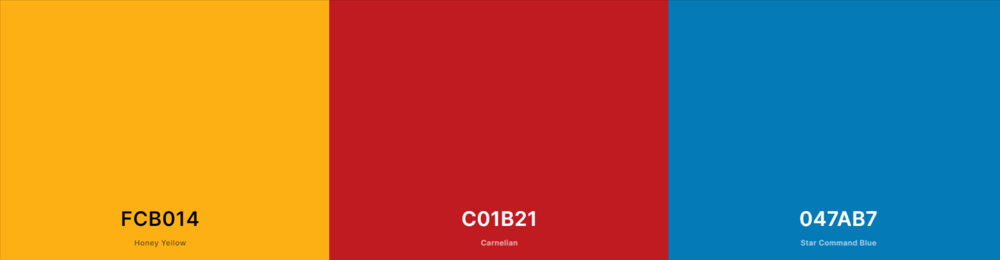

### Font Choice

The fonts that I have chosen have come from Google Fonts.
They are Audiowide for headings https://fonts.google.com/specimen/Audiowide.
It really has an 80s vibe off the font that goes with the overall theme.
For the main bodies of text I have chosen Oswald as I find these really compliment each other. https://fonts.google.com/specimen/Oswald

### Wireframes

My wireframes were done with Balsamiq https://balsamiq.cloud/ . These provided a good outline for my product.
In the building process my designs adapted and changed throughout so these might look abit different.

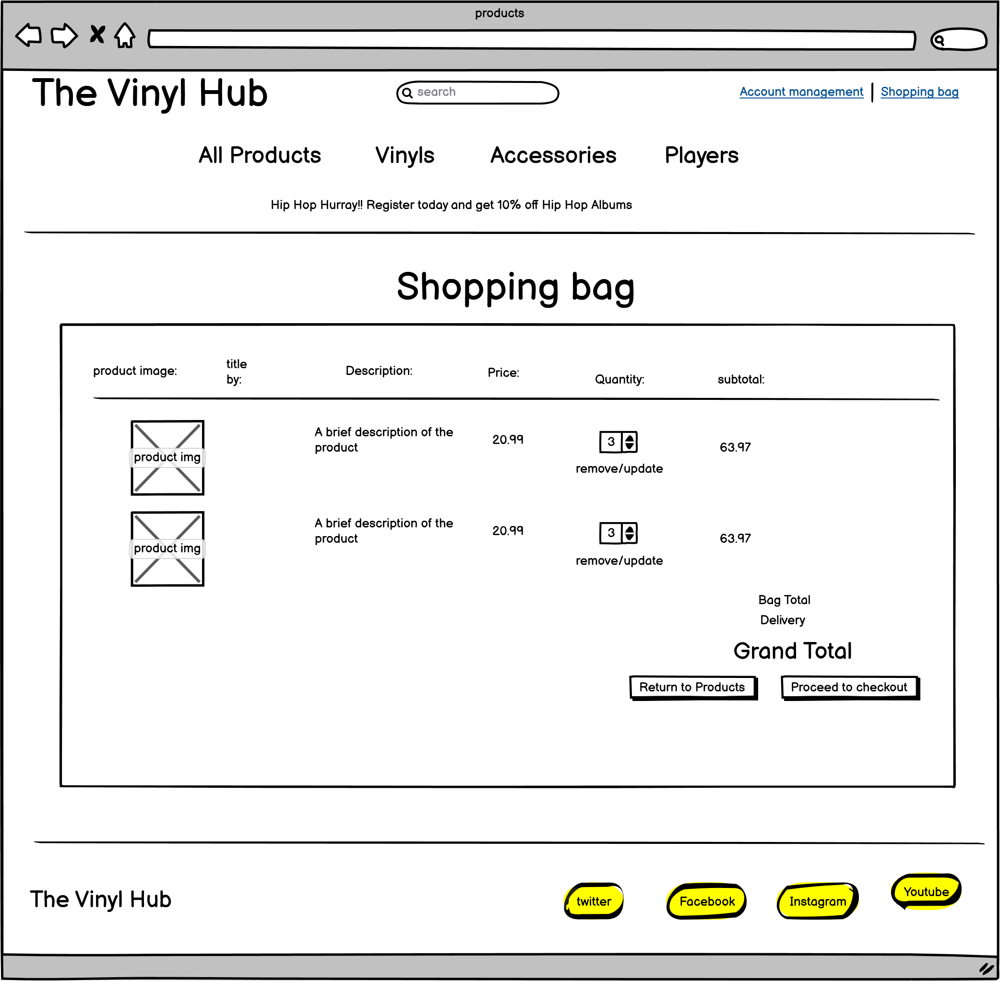

.png)

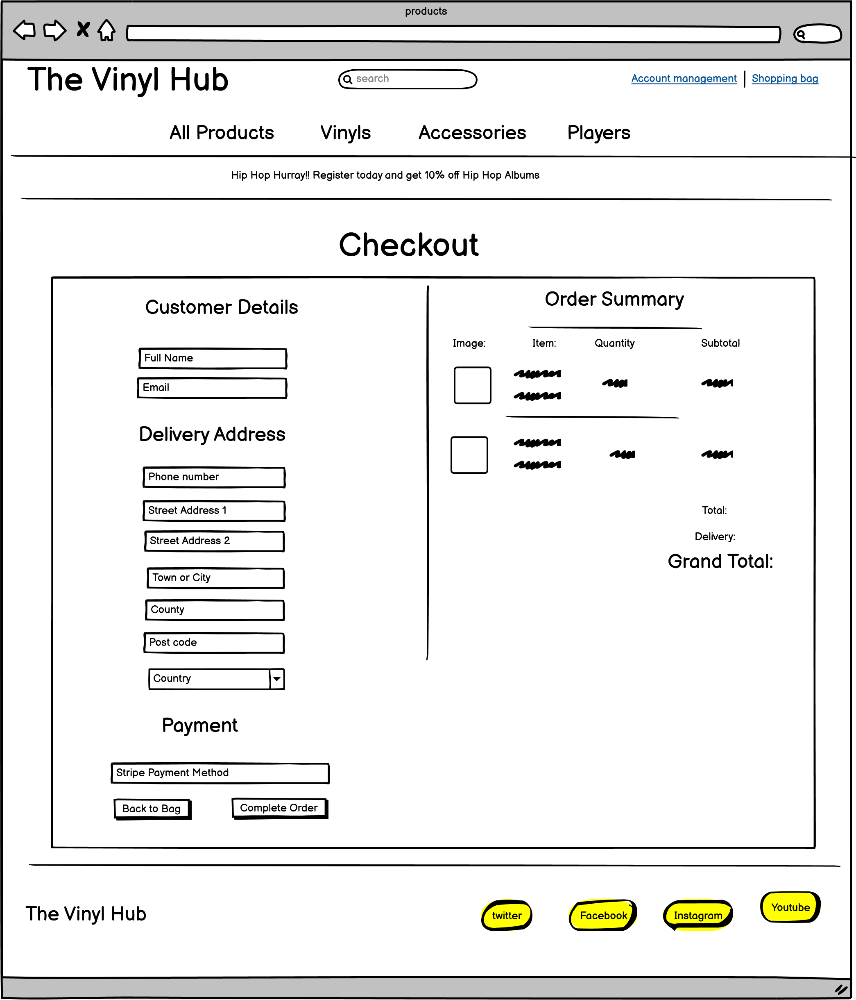

.png)

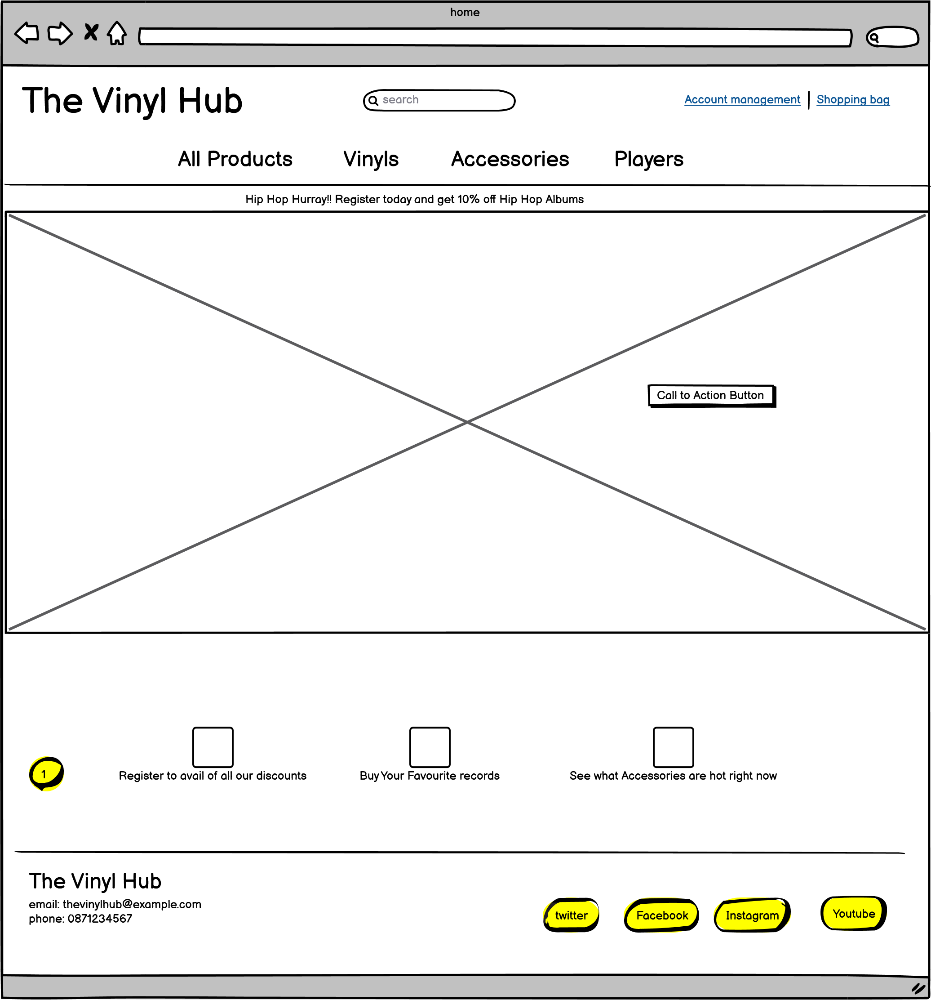

.png)

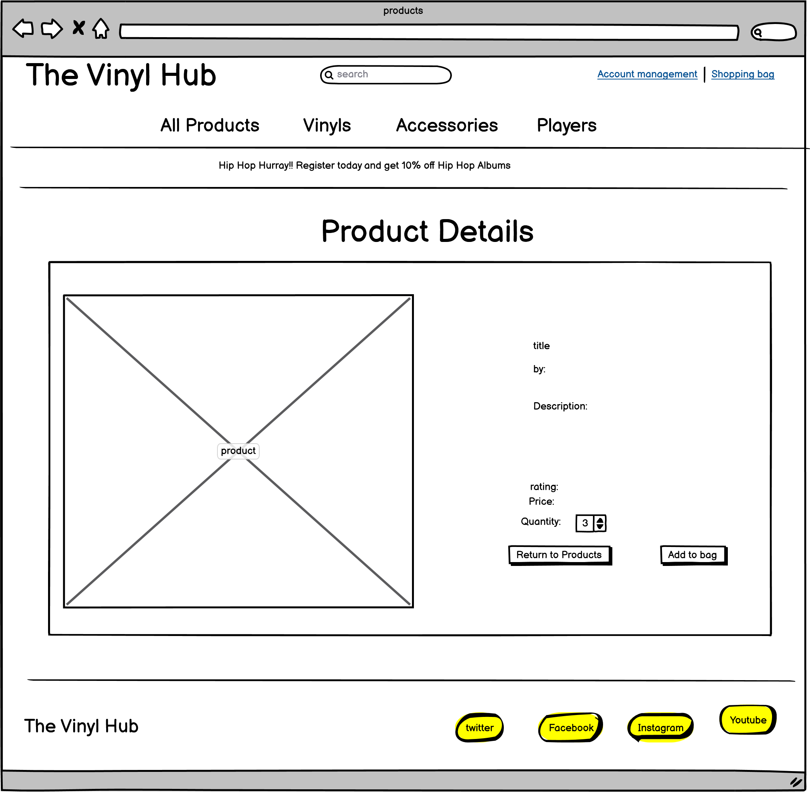

.png)

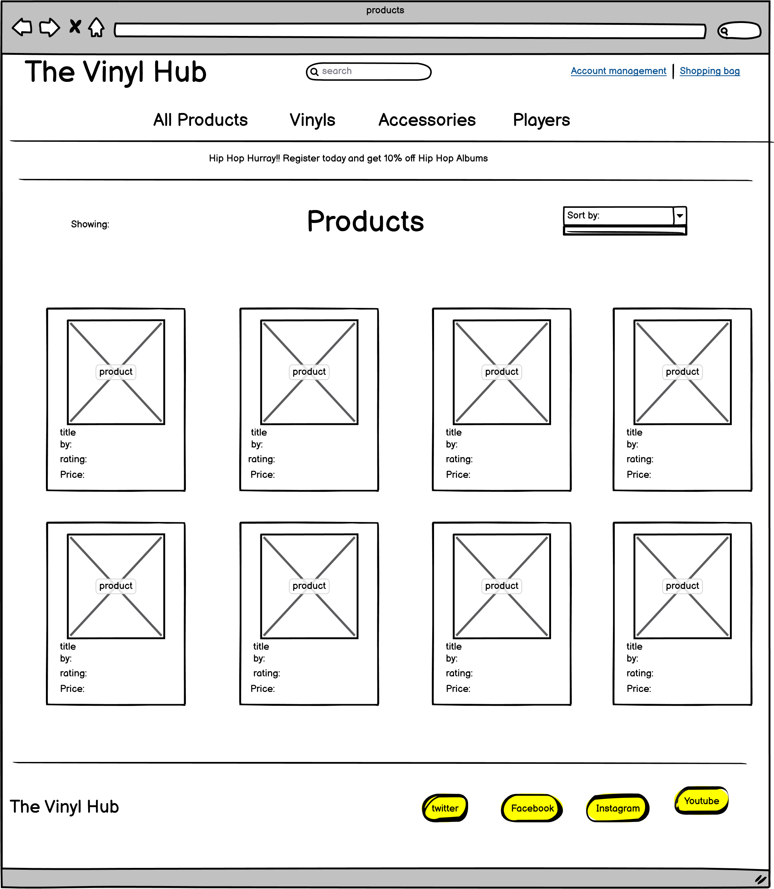

.png)

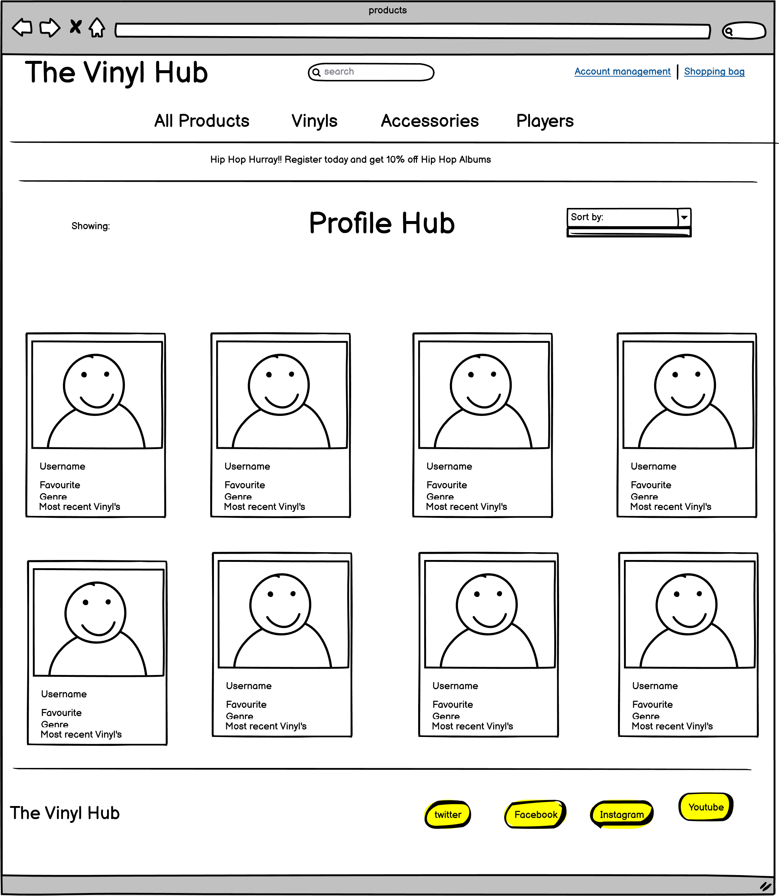

.png)

## Features

The first feature you see upon visiting the site is the responsive navbar.
This not only is great for navigating the site but it also has a serch field and a real time shopping bag which is 
continually updating your grand total.

This leads me nicely to the next feature where if the customer registers with the site they will receive a discount or special offer.
As of now that is 15% off all hip hop records. This is applied in real time through context processors.

When you register you will receive a confirmation email this will allow you to activate your user profile and build a profile.
At the moment its very basic but in the future it will be fleshed out. Here you can store your default delivery information for faster
checkouts in the future. 

A secure payment system from stripe where customers can pay with confidence.

A feature that will hopefully make it into this release is the request a product page. Where customers can request a product or record they would 
like to buy but find it hard to get.

## Future Features

The user profiles will be expanded into user profile section where users can interact with other users and have a
message system to promote traffic to the site.

I have added favourite genre to the user profile , whichever genre they pick will be used to show products on a carousel at the bottom
of the page for the user. Didnt have time to implement in this release.

## Technologies Used

- __HTML:__ The HyperText Markup Language, or HTML is the
 standard markup language for documents designed to be displayed in a web browser.

- __CSS:__ Cascading Style Sheets (CSS) is a style sheet language used for describing the presentation of a document written in a markup language such as HTML. 
 is a cornerstone technology of the World Wide Web, alongside HTML and JavaScript.[

- __JAVASCRIPT:__ JavaScript, often abbreviated as JS, is a programming language that conforms to the ECMAScript specification. JavaScript is high-level, often just-in-time compiled
, and multi-paradigm. It has curly-bracket syntax, dynamic typing, prototype-based object-orientation, and first-class functions. 

- __JQUERY:__ jQuery is a JavaScript library designed to simplify HTML DOM tree traversal
 and manipulation, as well as event handling, CSS animation, and Ajax.

- __DJANGO:__ Django is a Python-based free and open-source web framework that follows the model–template–views architectural pattern. It is maintained by the Django Software Foundation, an American independent organization established as a 501 non-profit.

- __PYTHON:__ Python is an interpreted high-level general-purpose programming language.
 Python's design philosophy emphasizes code readability with its notable use of significant indentation. 
 Its language constructs as well as its object-oriented
 approach aim to help programmers write clear, logical code for small and large-scale projects. 

- __SQLITE:__ SQLite is an in-process library that implements a self-contained, serverless, zero-configuration, transactional SQL database engine. The code for SQLite is in the public domain and is thus free for use for any purpose, commercial or private. SQLite is the most widely deployed database in the world with more applications than we can count, including several high-profile projects.

- __HEROKU POSTGRES:__ Heroku Postgres is a managed SQL database service provided directly by Heroku. You can access a Heroku Postgres database from any language with a PostgreSQL driver, including all languages officially supported by Heroku.

 - __Git:__ Git is a free and open source distributed version control system designed to handle everything from small to very large projects with speed and efficiency.
Git is easy to learn and has a tiny footprint with lightning fast performance. It outclasses SCM tools like Subversion,CVS, Perforce
, and ClearCase with features like cheap local branching, convenient
 staging areas, and multiple workflows.

 - __Github:__ GitHub is a Git repository hosting service, but it adds many of its own features. While Git is a command line tool, GitHub provides a Web-based graphical interface.
  It also provides access control and several collaboration features, such as a wikis and basic task management tools for every project.

- __BOOTSTRAP5:__ Bootstrap, the most popular front-end framework built to design modern, responsive, and dynamic interfaces for professional design web pages, is currently undertaking a major update, Bootstrap 5.

- __Gitpod:__ Gitpod is a container-based development platform that puts developer experience first. Gitpod provisions ready-to-code development environments in the cloud accessible
 through your browser and your local IDE (stay tuned for a blog post with more details on that).

- __VSCODE:__ Visual Studio Code is a source-code editor made by Microsoft for Windows, Linux and macOS. Features include support for debugging, syntax highlighting,
  intelligent code completion, snippets, code refactoring, and embedded Git.

- __STRIPE:__ Stripe is an Irish-American financial services and software as a service company dual-headquartered in San Francisco, United States and Dublin, Ireland. The company primarily offers payment processing software and application programming interfaces for e-commerce websites and mobile applications.

- Along with all of these technologies I used packages and other bits from these in development.They can also be found in my requirements.txt file

- asgiref==3.4.1
- boto3==1.18.29
- botocore==1.21.29
- crispy-bootstrap5==0.5
- dj-database-url==0.5.0
- Django==3.2.6
- django-allauth==0.41.0
- django-countries==7.2.1
- django-crispy-forms==1.12.0
- django-storages==1.11.1
- gunicorn==20.1.0
- jmespath==0.10.0
- oauthlib==3.1.1
- Pillow==8.3.1
- psycopg2-binary==2.9.1
- pylint-django==2.4.4
- pylint-plugin-utils==0.6
- python3-openid==3.2.0
- pytz==2021.1
- requests-oauthlib==1.3.0
- s3transfer==0.5.0
- sqlparse==0.4.1
- stripe==2.60.0

## Manual Testing 

I have been doing continual testing throughout development , catching bugs outlined further on, So I will concentrate my manual testing on 
the user stories I have generated as this covers all aspects of functionality! crud operations payments and database manipulation.
Here is the link for the [manual testing](manual_testing.md)

## Bugs & Fixes 

* Had an issue on the home page when I was checking responsiveness the h1 was being going over the page on devices under 700px.
* This was a straight forward fix as I was able to adjust the font-size with media queries
* Had an issue with the contrast of the blue text on the white background that would of been an issue 
for users due to a contrast issue.
* I solved this by switching from `#018bd4` to a slightly deeper blue `#047ab7`
* Encountered a bug when I was updating my products page where the icon for each product appeared several times instead of once.
* I checked my code and relised i left out the closing i tag
* Encountered a bug when using javascript to update the quantity on the bag , it wouldnt trigger the form to update
* I solved this my giving the form an id and targetting it directly
* Upon further testing this was only updating the first item in the bag.
* So I rechecked my bag.html and after alot of headscratching realised for stlying I put the 2 anchors in a div and this stopped my javascript function from finding the form class with the .prev method. I deleted the div and this solved the issue.
* Had an issue with my messages where they would trigger but I couldn't see them , through Chrome Dev tools I could see the outline on the page
so after checking the bootstrap 5 documentation I found this snippet `Options can be passed via data attributes or JavaScript. For data attributes, append the option name to data-bs-, as in data-bs-animation="".` they were `True` by default so I changed data-bs-autohide to `False` and the messages started to appear.
* I had a big issue with my line item order , in fixing it I managed to mess up my discount context processor 
* To fix this I had to rework the discount to a straight 15% for registered users. This is something that will be adjusted in later releases.
* Have an issue on deployment to heroku where my media files in certain folders are not loading
*  I solved this my altering te jinja templates
* Issue where the profile form is not saving the media for user profiles , but is when adding manually through the admin.
* I added request.FILES to the view and added enctype to the form this solved the issue.

## Html and CSS Validation

Passed all HTML and CSS was passed too but it only didnt recognise the :is pseudo selector, I checked and it seems to be used quiet alot
so I decided to keep it in.

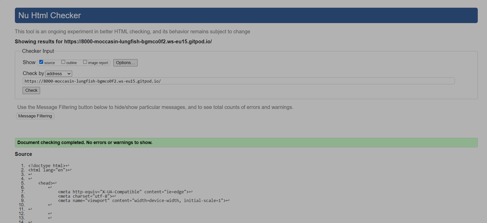

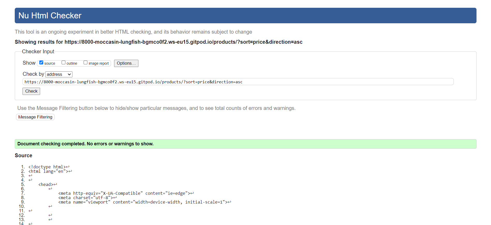

## Credits 

* The images for the record players and the description were taken from https://www.worldwidestereo.com/blogs/wws-underground/entries/best-turntables.
* The images for the vinyls and the descriptions were taken from https://longlivevinyl.net/2020/02/18/the-essential-hiphop/ and https://www.radiox.co.uk/features/best-vinyl-records-to-collect/