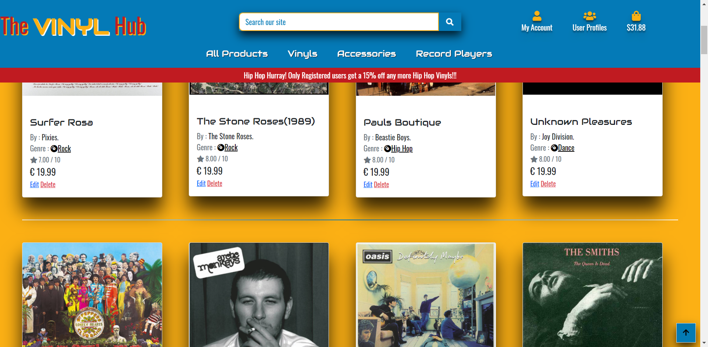
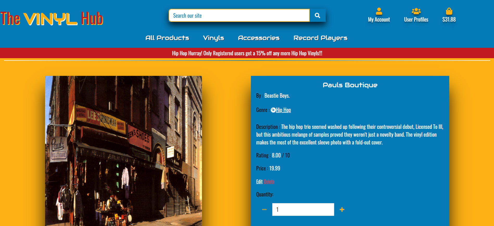

# Manual Testing 

## Part 1 User stories 1 - 5 

These stories all focus on what a shopper expects to see in the site and are all related together.

1. View a list of products . This is readily available to the shopper , they can click on the all products link in the nav or the shop now button and this will take them to the all products page. All works like its supposed to. 

2. View a single products details. This is achieved by selecting the desired product from the all products page or 
by filtering or searching and clicking on the image. This brought me to the product details page where I could see the chosen 
products details.

3. See Below

4. These can be seen from the same test as they are purely visual, you can see on the banner underneath the navbar that theres 15% off for registered users and the shopping bag icon is counting the grand total see image below

5. This is for customers to see what they have spent and to see if they have received any discounts.This can be seen in the bottom right hand
corner of the shopping bag. While here I noticed that I accidently put the dollar sign in 2 totals, I fixed that now.

## User Stories 