# Manual Testing 

## Part 1 User stories 1 - 5 

These stories all focus on what a shopper expects to see in the site and are all related together.

1. View a list of products . This is readily available to the shopper , they can click on the all products link in the nav or the shop now button and this will take them to the all products page. All works like its supposed to. 

2. View a single products details. This is achieved by selecting the desired product from the all products page or 
by filtering or searching and clicking on the image. This brought me to the product details page where I could see the chosen 
products details.

3. See Below

4. These can be seen from the same test as they are purely visual, you can see on the banner underneath the navbar that theres 15% off for registered users and the shopping bag icon is counting the grand total see image below. I checked this in real time where I was logged out , and 
was charged full price then logged in and it popped up in my screen the discount as soon as I had logged in

5. This is for customers to see what they have spent and to see if they have received any discounts.This can be seen in the bottom right hand
corner of the shopping bag. While here I noticed that I accidently put the dollar sign in 2 totals, I fixed that now.

## User Stories 6 - 12

6. Its easy to register for an account, I have done this through All auth and customized the look of it. Just pressed the log in button in the navbar under my account, it brought me to the register screen. I created an account , I got sent the confirmation email, I followed the link and all worked as expected.

7. After creating an account I tried to log in with the details provided. IT worked as expected

8. Logging out was achieved by going to the navbar clicking on my account I was brought to the log out page. I clicked log out , all worked as intended.

9. I wasnt able to implement this feature yet

10. When users complete an order they can save their default delivery details, I expanded this a little further and on the profile screen they can add a profile pic and their favourite genre. This all works as intended making checkout faster but this is the foundation for future features.

11. This will be implemented in a future release.

12. Receive an email confirmation after registering. I tried the whole process and it all worked as intended.

All these user stories are related and I tested them in the same process so below are some screenshots of the tests.

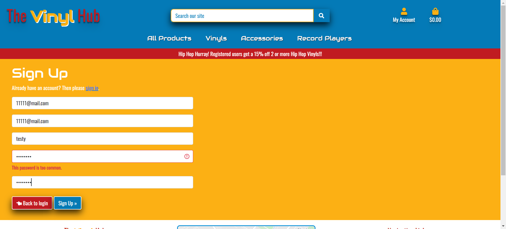

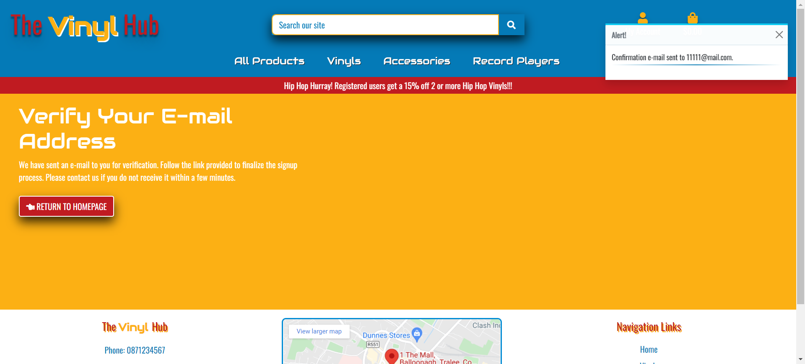

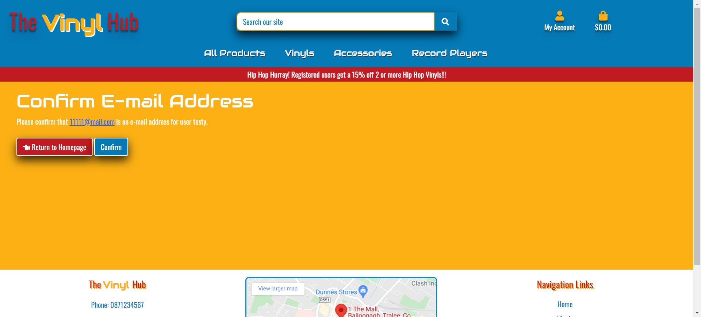

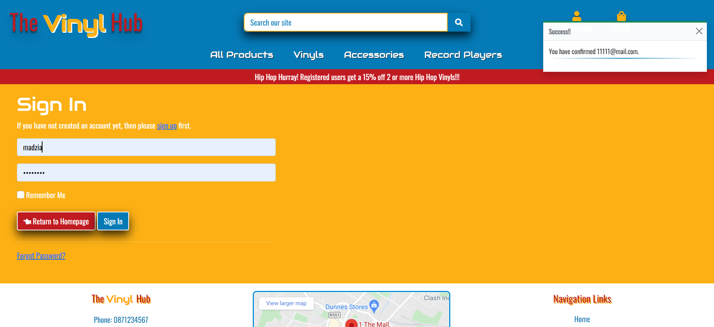

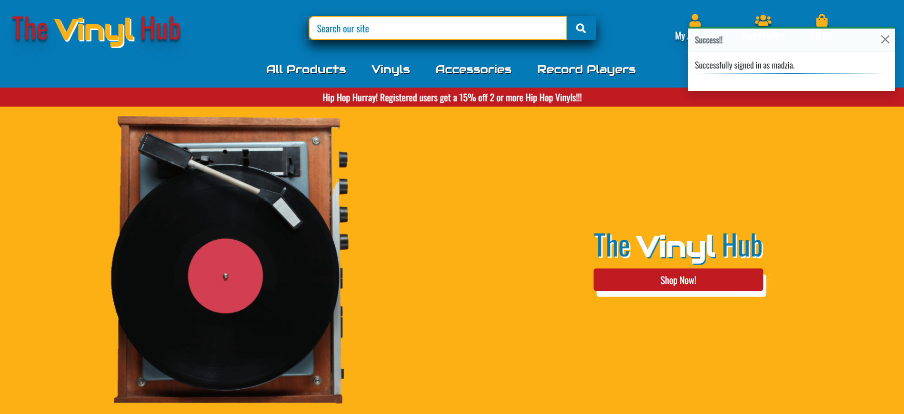

## User Stories 13 -17

These user stories all focus on the sorting and searching for products and returning the requested products. I tested all the sorting and
search functions in the nav bar and all worked as expected.

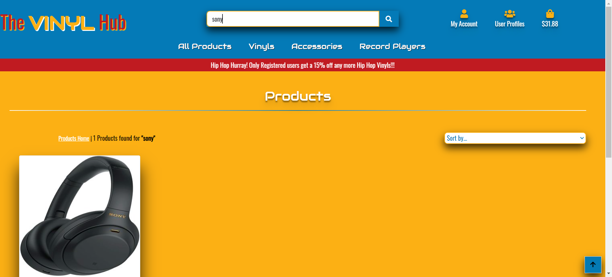

## User Stories 18 - 24

These all have to do with completing the shopping experience from checking out with your bag
to paying and then receiving the confirmation email. I rigorously tested these and the accompanying webhooks for safety and security. 
All payments were received along with the accomanying email and registered users have an order history in their profile.

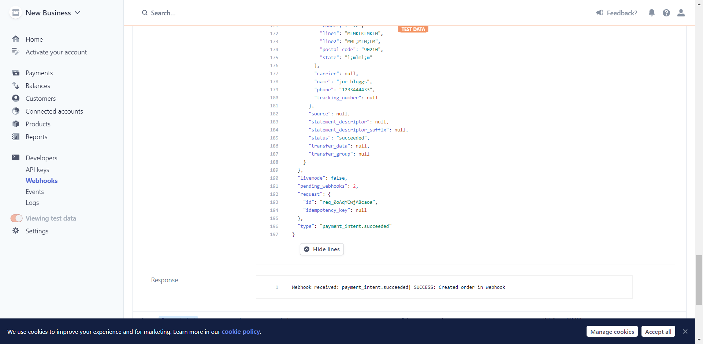

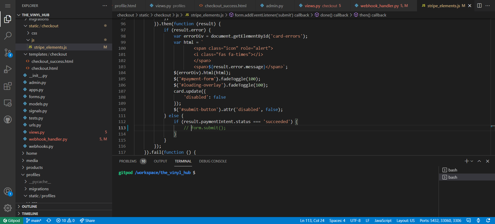

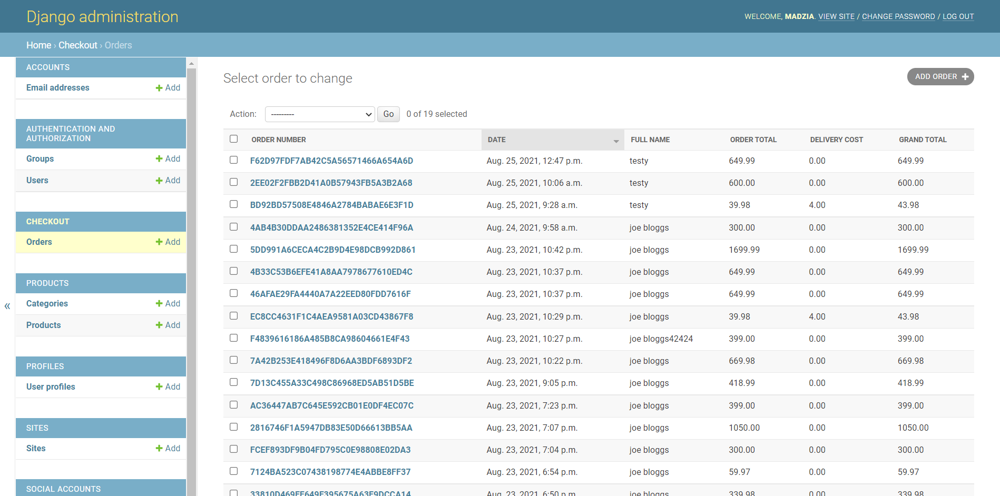

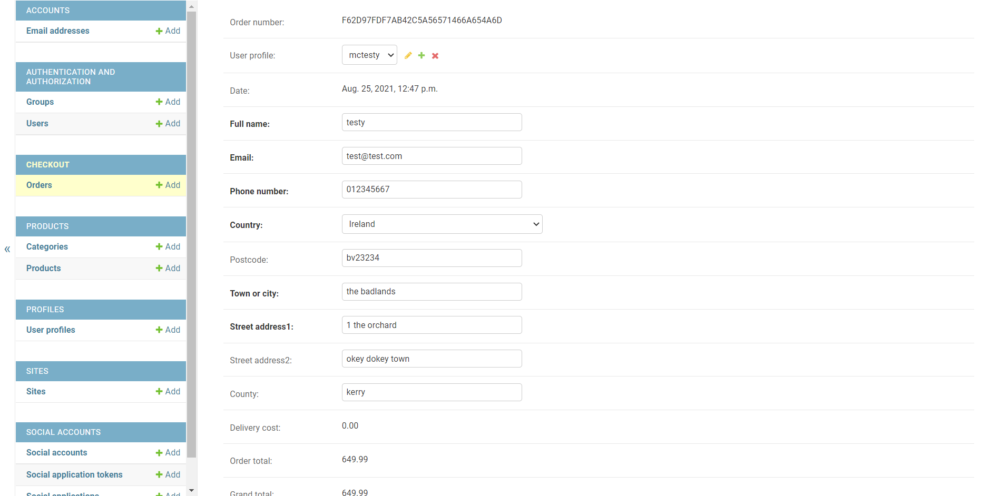

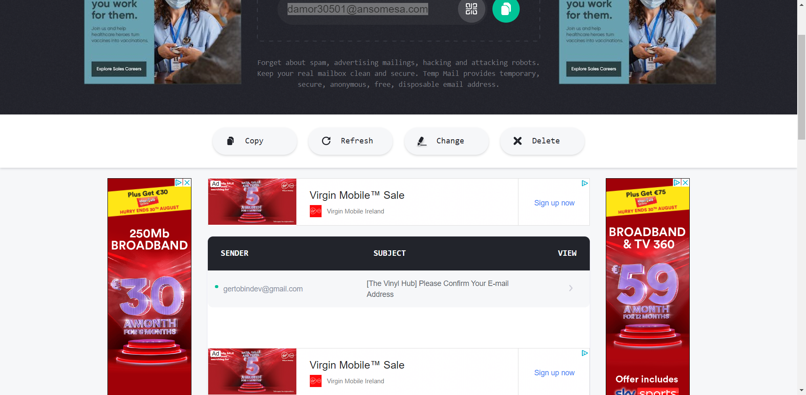

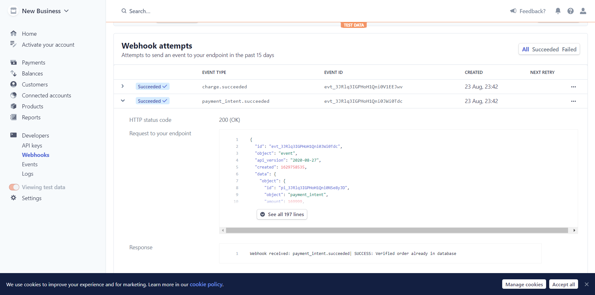

## User Stories 25 - 28

These all have to do with the crud functionality for store owners.
These options are only availabe to store owners. To test these firstly  I added products to the store.
I then searched for them and when I found them I edited them, then I searched again and when I found it again I deleted it.
I went to the admin and checked the products model and it was deleted. WOrked as intended

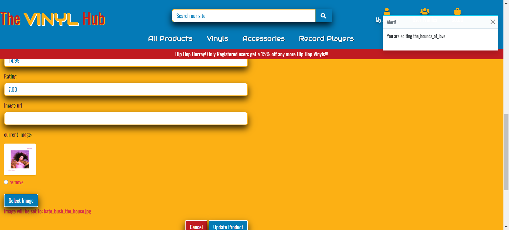

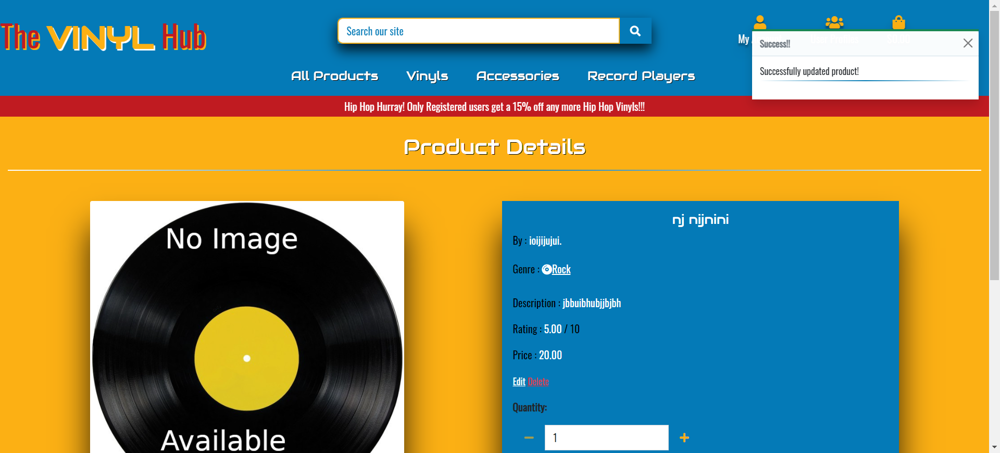

## Subsuquent User Story

In development I alwas thought about user feedback and delivered this through toasts from bootstrap,
it was an oversight in my user stories but have developed the site with this in mind and tested throughout and 
site users are informed of their actions.

## Usability 

- I have checked the navbar and sidenav bar and all direct to the intended pages and work correctly.

- All buttons and navigation buttons redirect to intended locations with no errors.

- I have used black text on the background colours that I have chosen as it gives the greatest contrast for readability.

- Buttons and Nav are bright and easy to see and use.

- All user actions recieve clear feedback.

## Database Testing

- This was carried out in my functionality testing as I was checking the database was storing updating and deleting 
data as requested. I came across no errors.

## Compatibility Testing

- I was basing my development on Google Chrome and was doing all my tests on that browser, so to make sure it was working on 
other browsers too I tested them on mozilla firefox and microsoft edge.

- I opened my website in firefox and did all the previous checks and I didnt notice anything different , everything behaved as expected.

- I opened my website in microsoft edge and again everything worked as expected and it all appeared as expected.

## Responsiveness Testing
I had been checking throughout for responsiveness issues with chrome developer tools, came accross a few issues with the dynamic elements
in the navbar but I seem t have olved all of them with media queries